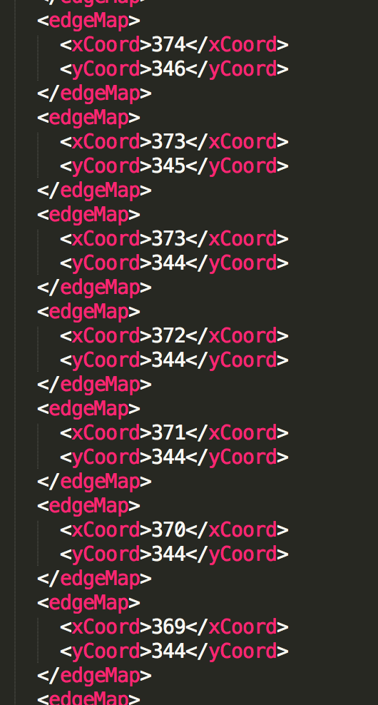

# Medical-Image-process

## Overview
- [Data Collection](#Data-Collection)
- [Paper Collection](#Paper-Collection)
- [GAN code](#Code)

# Data Collection
- Data description including sample image [[link]](http://bioimage.ucsb.edu/research/bio-segmentation)
- [LIDC-IDRI](https://wiki.cancerimagingarchive.net/display/Public/LIDC-IDRI#495b82e81b5f4adbb9a1418cb9bb03e6): Lung CT Scans with annotated lesions.
  - Format: DICOM (images), XML (annotations)

  - Sample: 
     

     with annotations for the coordinates of points on the edge of lesions:

     

# Paper Collection
- Deep MR to CT Synthesis using Unpaired Data [[arXiv]](https://arxiv.org/abs/1708.01155)

# Code
- [[BEGAN-tensorflow]](https://github.com/carpedm20/BEGAN-tensorflow)
